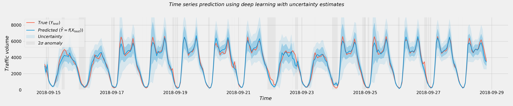
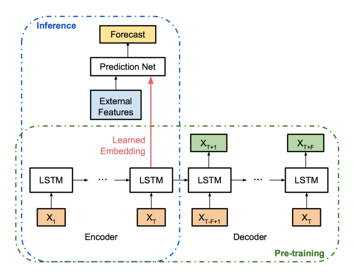
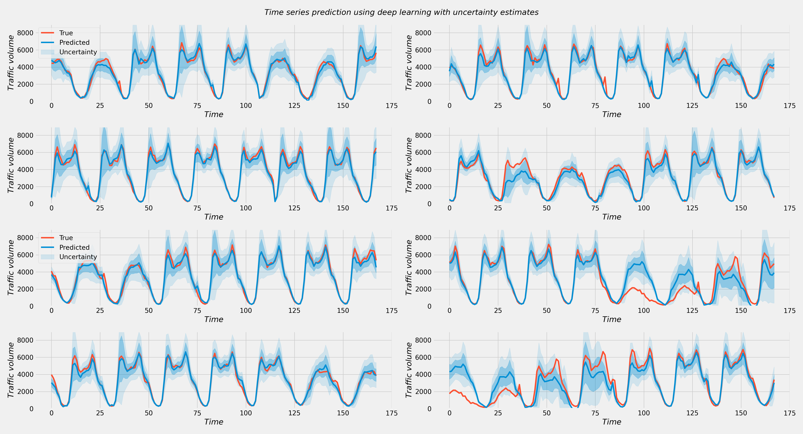

# Bayesian time series prediction


End to end implementation of paper [Deep and Confident Prediction for Time Series at Uber](https://arxiv.org/abs/1709.01907) in PyTorch. We use the [Metro Interstate Traffic Volume](https://archive.ics.uci.edu/ml/datasets/Metro+Interstate+Traffic+Volume) multivariate time series dataset for training and eventually predicting traffic volume.

We make use of the implementation of [variational dropout](https://arxiv.org/abs/1512.05287) from [keitakurita/Better_LSTM_PyTorch](https://github.com/keitakurita/Better_LSTM_PyTorch) for the LSTM layers with dropout.

## Workflow


Code is prototyped in the [`notebooks`](notebooks) before transfer into cleaned up Python scripts for reuse.

- [`notebooks/01_dataset_creation.ipynb`](notebooks/01_dataset_creation.ipynb)
  - Download dataset from UCI repository, preprocessing, cleaning and feature creation
  - → [`src/data.py`](src/data.py)
- [`notebooks/02_encoder_decoder.ipynb`](notebooks/02_encoder_decoder.ipynb)
  - Prototype the encoder-decoder pretraining part of the model
  - → [`models/encoder_decoder.py`](models/encoder_decoder.py)
  - → [`src/utils.py`](src/utils.py)
- [`notebooks/03_encoder_decoder_dropout.ipynb`](notebooks/03_encoder_decoder_dropout.ipynb)
  - Prototype the encoder-decoder pretraining part of the model using [LSTM cells with dropout](https://github.com/keitakurita/Better_LSTM_PyTorch)
  - → [`models/encoder_decoder_dropout.py`](models/encoder_decoder_dropout.py)

- [`notebooks/04_pretraining_hyperparam.ipynb`](notebooks/04_pretraining_hyperparam.ipynb)
  - Use [`Ax`](https://github.com/facebook/Ax) for guided hyperparameter search in the pretraining of encoder-decoder. We use GCE compute for GPU acceleration
  - → [`src/utils.py`](src/utils.py)
- [`notebooks/05_pretraining_embedding.ipynb`](notebooks/05_pretraining_embedding.ipynb)
  - Taking a look at the learned pretraining embedding
  - → [`src/utils.py`](src/utils.py)
- [`notebooks/06_prediction_network.ipynb`](notebooks/06_prediction_network.ipynb)
  - Prototype the prediction network and run `Ax` for hyperparameter search
  - → [`src/utils.py`](src/utils.py)
  - → [`src/data.py`](src/data.py)
  - → [`models/prediction.py`](models/prediction.py)
- [`notebooks/07_full_inference.ipynb`](notebooks/07_full_inference.ipynb)
  - Implement the full inference including uncertainty calculation algorithms, run the test data through inference and plot results
  - → [`src/inference.py`](src/inference.py)
- `notebooks/08_evaluation.ipynb`
  - Evaluate results 


## Results
Time series predicitons using the full inference algorithm including uncertainty bounds:



## Requirements
```
numpy
pandas
torch
tqdm
matplotlib
ax-platform
```
