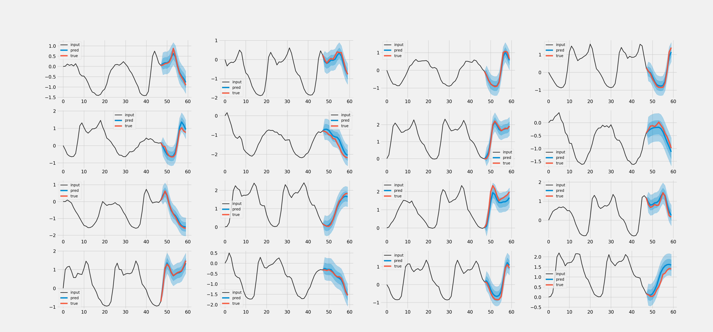

# Bayesian time series prediction

Implementation of paper [Deep and Confident Prediction for Time Series at Uber](https://arxiv.org/abs/1709.01907) in PyTorch using the [Metro Interstate Traffic Volume](https://archive.ics.uci.edu/ml/datasets/Metro+Interstate+Traffic+Volume) dataset.

We make use of the implementation of [variational dropout](https://arxiv.org/abs/1512.05287) from [keitakurita/Better_LSTM_PyTorch](https://github.com/keitakurita/Better_LSTM_PyTorch).

The first four notebooks work up to the full implementation in notebook 5.

## Results



## Requirements
```
numpy
pandas
torch
tqdm
matplotlib
```
